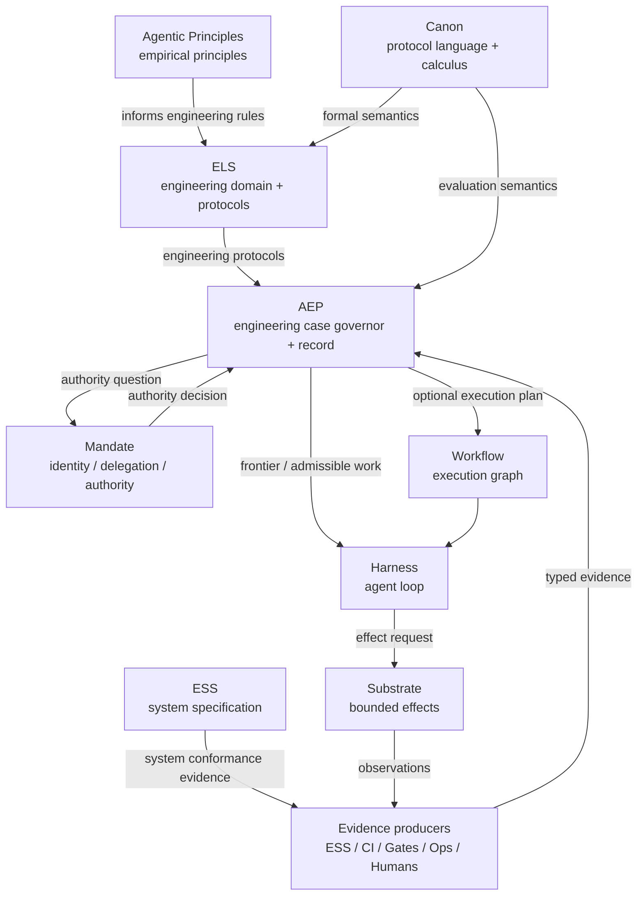

# Canon — Protocol Specification Language and Calculus

**Status:** Design proposal  
**Codename / project name:** Canon  
**Proposed repository:** `beyond10x/canon`  
**Proposed CLI:** `canon`  
**Protocol source format:** `protocol/1`  
**Compiled representation:** `canon-ir/1`  
**Case envelope:** `case/1`  
**Evaluation output:** `canon-decision/1`  
**Conformance report:** `canon-conformance/1`  
**Date:** 2026-10-03

---

## 1. Executive summary

Canon is a proposed **formal language and deterministic calculus for specifying evidence-governed protocols**.

A protocol defines how a goal-directed undertaking may legitimately progress by declaring:

- the claims that may be made;
- the evidence that can establish or contradict those claims;
- the artifacts and revisions to which evidence applies;
- the obligations that must be discharged;
- the actions that are admissible;
- the authority required for consequential actions;
- the rules that invalidate prior knowledge;
- the transitions that may be earned;
- the recovery paths available after failure;
- and the outcomes under which a case may legitimately conclude.

Canon does **not** execute the work. It does not run agents, mutate repositories, deploy systems, authenticate users, own credentials, or persist a workflow service.

Canon answers a narrower and more foundational question:

> **Given a protocol, a live case, the available evidence, authority decisions, and an evaluation instant: what is currently known, owed, admissible, blocked, earned, or legitimately concluded?**

The intended hierarchy is:

```text
Canon
  generic protocol specification language + semantics
      |
      v
ELS
  Engineering Lifecycle Specification
  engineering-domain vocabulary, rules, and protocol families
      |
      +--> software.change/1
      +--> incident.response/1
      +--> ml.experiment/1
      +--> engineering.investigation/1
      +--> migration/1
      |
      v
AEP
  reference governor + durable engineering record
      |
      v
Case instances
  CHG-123, INC-492, EXP-42, ...
```

The concise ecosystem statement becomes:

> **Canon defines the grammar of legitimate work. ELS defines engineering protocols in that grammar. AEP governs live engineering cases. ESS defines system behavior and produces conformance evidence. Mandate resolves authority. Harness performs agent work. Substrate bounds effects. Workflow may execute operational graphs derived from or used by a protocol.**

---

## 2. Why this project exists

The design began with a seemingly narrower question: how should software development be formally specified for the agentic era?

An initial Engineering Lifecycle Specification model introduced concepts such as:

```text
Change
Artifact
Claim
Evidence
Obligation
Authority
Transition
Outcome
Invalidation
Recovery
```

That model worked well for software delivery. But applying it to adjacent forms of engineering work exposed something important.

The same concepts also describe:

- SRE incident response;
- security investigations;
- ML experimentation;
- performance investigations;
- migrations;
- architecture investigations;
- scientific or empirical engineering research;
- and, with appropriate domain vocabulary, even physical engineering programs.

The software-specific part was not the underlying logic. It was mostly the **domain vocabulary and normative rule packages** layered on top of it.

That suggests a cleaner separation:

1. a generic protocol formalism;
2. an engineering domain specification built in that formalism;
3. concrete protocols for particular classes of engineering work;
4. live governed cases;
5. execution systems that perform admissible actions and return evidence.

Canon is proposed as layer 1.

---

## 3. Design evolution from this session

This section records the design evolution at a high level. It is intended to preserve the rationale, not to reproduce private reasoning traces.

### 3.1 Starting point: AEP looked larger than a planning store

The discussion began by examining AEP beyond its Git-native planning surface.

The useful observation was that AEP already contains a deeper deterministic model around:

- legal moves;
- capabilities and authorization;
- obligations;
- evidence;
- evidence freshness and provenance;
- guarded transitions;
- completion decisions;
- workflow driving;
- and observations of agent behavior.

That suggested describing AEP not merely as project planning, but as a **governor for engineering work**.

### 3.2 First extraction: Engineering Lifecycle Specification

The next step was to ask whether the lifecycle of software development itself should be formalized.

The proposed ELS model shifted focus away from a waterfall such as:

```text
requirements -> design -> implementation -> test -> deploy
```

and toward claims such as:

```text
intent.accepted
specification.valid
implementation.verified
release.proven
deployment.healthy
objective.realized
```

with evidence bound to explicit revisions.

That produced a strong model for proof-carrying engineering change.

### 3.3 The abstraction leak: incidents and research fit too well

The next question was whether an "engineering lifecycle" only meant building software.

Incident response immediately stressed the model in a useful way. An incident is not primarily a change. It is a case in which operational state, causal understanding, coordination, and learning may progress in parallel.

ML research stressed it differently. A research undertaking may conclude with a hypothesis supported, refuted, or inconclusive, without necessarily producing a deployed system change.

Both domains still fit the same core semantics:

```text
Claim
Evidence
Obligation
Action
Authority
Outcome
Invalidation
Recovery
```

At that point `Change` was too narrow as the generic root object. `Case` was a better primitive.

### 3.4 One dimension higher: protocol specification language

The resulting insight is that ELS itself should not have to define both:

1. what claims, evidence, obligations, actions, authority, and outcomes mean in general; and
2. what those things mean specifically for engineering.

Canon extracts the first concern.

ELS becomes an engineering-domain model written using Canon.

### 3.5 The meta aspect

This creates an intentionally recursive possibility:

```text
Canon defines how protocols are specified.
ELS is a protocol-domain specification written using Canon.
A Canon-change protocol can govern changes to Canon itself.
```

Eventually:

```text
A protocol written in Canon
  governs a case
    whose subject is Canon
      and whose outcome may change the Canon language.
```

That is not intended as clever wordplay. It is a useful bootstrap property.

The system becomes self-hosting when modifications to the protocol language can themselves be conducted under a protocol with stronger compatibility, conformance, and migration obligations.

---

## 4. Terminology

### 4.1 Protocol

A **Protocol** is a typed normative specification governing the progression of a Case.

A protocol may define:

- artifacts;
- facts;
- claims;
- evidence kinds;
- obligations;
- actions;
- authority requirements;
- transitions;
- invalidation rules;
- recovery rules;
- outcomes.

A protocol is static, versioned input.

### 4.2 Case

A **Case** is one concrete undertaking governed by a Protocol.

Examples:

```text
CHG-123   software change
INC-492   production incident
EXP-42    ML experiment
INV-18    engineering investigation
MIG-77    data migration
```

A Case has stable identity even while its artifacts, claims, evidence, and current frontier evolve.

### 4.3 Evaluation

An **Evaluation** is the deterministic interpretation of a Case under a Protocol at a particular instant.

It answers questions such as:

- Which claims are `TRUE`, `FALSE`, or `UNKNOWN`?
- Which obligations are open?
- Which evidence is currently applicable?
- Which actions are admissible?
- Which actions require authority?
- Which conclusions are blocked?
- Which transitions are earned?
- Which outcomes are currently legitimate?

### 4.4 Frontier

The **Frontier** is the currently actionable boundary of a Case.

It is a projection of an Evaluation intended for a planner, human, agent, or workflow system.

A frontier can include:

```text
open obligations
admissible actions
conditionally admissible actions
blocked actions
available transitions
blocked conclusions
useful missing evidence
```

### 4.5 Evidence

**Evidence** is a typed observation about a subject.

Evidence may establish, contradict, or fail to decide one or more claims.

Evidence is not equivalent to a claim made by the actor performing the work.

### 4.6 Outcome

An **Outcome** is a declared legitimate terminal interpretation of a Case.

Examples:

```text
accepted
restored
supported
refuted
declined
superseded
inconclusive
rolled_back
abandoned
```

---

## 5. Canon is a specification language, not a protocol library

The most precise description is:

> **Canon is a formal language and calculus for specifying evidence-governed protocols.**

In metamodel terms:

```text
Canon
= protocol specification language + formal semantics

        ↓ used to define

ELS
= engineering-domain protocol model

        ↓ used to define

software.change/1
incident.response/1
ml.experiment/1
= concrete protocol specifications

        ↓ instantiated as

CHG-123
INC-492
EXP-42
= cases
```

It is therefore informally a "protocol specification specification," but the more useful established concepts are:

- specification language;
- metamodel;
- calculus;
- formal semantics.

Canon should be discussed in those terms.

---

## 6. Core design principle: legitimacy, not sequencing

A workflow usually answers:

> **What executes next?**

Canon answers:

> **What is currently legitimate?**

That distinction is foundational.

A workflow might define:

```text
inspect -> diagnose -> repair -> verify
```

Canon may instead establish:

```text
service.health = UNKNOWN
cause.identified = UNKNOWN
impact.mitigated = TRUE

obligation:
  establish current service health

actions currently admissible:
  inspect metrics
  compare regions
  inspect recent changes

rollback:
  admissible only if authority production.rollback is held

close incident:
  not legitimate because service.health is UNKNOWN
```

A workflow can be one implementation strategy for obtaining the evidence needed by a protocol.

It is not the semantic owner of why the result is sufficient.

---

## 7. Core semantic dimensions

Canon combines three orthogonal dimensions that are often blurred together.

### 7.1 Epistemics

```text
What is known?
What is contradicted?
What remains unknown?
What evidence establishes a claim?
What revision does that evidence concern?
Is the evidence still fresh?
Is the producer sufficiently independent?
```

### 7.2 Governance

```text
What is required?
What is permitted?
What is forbidden?
What requires authority?
What obligations remain open?
What makes an outcome sufficient?
```

### 7.3 Progression

```text
What transitions are legal?
What actions are currently admissible?
What becomes invalid after a change?
What recovery paths exist?
What outcomes may terminate the case?
```

Workflow systems can consume these decisions, but Canon owns their formal meaning.

---

## 8. Three-valued claims

Canon uses three-valued claim evaluation:

```text
TRUE
FALSE
UNKNOWN
```

Meanings:

- `TRUE`: applicable evidence establishes the predicate.
- `FALSE`: applicable evidence contradicts the predicate.
- `UNKNOWN`: the available applicable evidence is insufficient to decide.

Only `TRUE` satisfies a positive requirement.

Examples:

```text
tests never run                           -> UNKNOWN
tests ran and failed                      -> FALSE
tests ran and passed                      -> TRUE
tests passed for R1; current revision R2  -> UNKNOWN
health was good two hours ago; max age 5m -> UNKNOWN
```

`UNKNOWN` and `FALSE` imply different next actions and must never be collapsed.

---

## 9. Revision and subject binding

Evidence applies to explicit subjects.

Example:

```yaml
format: evidence/1

kind: test_result

subject:
  type: implementation
  id: change/CHG-123/implementation
  revision: sha256:9c992f...

producer:
  principal: service:ci
  implementation: github-actions
  version: v14

observed_at: 2026-10-03T13:04:22Z

result:
  verdict: pass
```

If the current implementation changes from revision R1 to R2, evidence bound to R1 does not silently establish claims about R2.

The same applies to:

- approvals;
- reviews;
- specifications;
- experiment datasets;
- model checkpoints;
- deployment revisions;
- inspection records;
- safety certificates;
- observations with freshness constraints.

---

## 10. The Action primitive

Canon includes **Action** because a protocol intended to guide agents must describe more than gates.

Example:

```yaml
action:
  id: inspect.metrics

requires:
  authority:
    capability: telemetry.read

applicable_when:
  claim: cause.identified
  is_not: true

may_produce:
  - evidence: telemetry_observation
  - evidence: anomaly_observation

effect:
  class: read_only
```

An Action does not have to be an executable workflow node.

It is a semantically named possibility that:

- may be admissible under current conditions;
- may require authority;
- may have an effect class;
- may produce particular classes of evidence.

A planner, human, agent, or workflow engine chooses how to carry it out.

---

## 11. The protocol-driven agent loop

The canonical agent interaction should be **frontier-driven**, not script-driven.

```text
        protocol + live case
                |
                v
        Canon evaluation
                |
                v
          current frontier
                |
                v
          planner / agent
                |
         chooses admissible action
                |
                v
       Harness / Workflow / tool
                |
                v
            real effect
                |
                v
            observation
                |
                v
             evidence
                |
                +--------------------+
                                     |
                                     v
                              Canon reevaluation
```

The agent asks:

> **Given the current case, what actions are currently admissible and useful?**

It does not need a hardcoded numbered script.

This allows adaptation while preserving deterministic governance.

---

## 12. Source language

The protocol source format should be named independently from the Canon implementation.

Proposed:

```text
protocol/1
```

Example:

```yaml
format: protocol/1

protocol:
  id: investigation
  revision: 1

case:
  inputs:
    question:
      type: string

claims:
  explanation.supported:
    true_when:
      all:
        - evidence:
            kind: supporting_observation
        - evidence:
            kind: falsification_attempt
            result: survived

actions:
  inspect:
    may_produce:
      - evidence: supporting_observation

  attempt_falsification:
    may_produce:
      - evidence: falsification_attempt

outcomes:
  supported:
    requires:
      claim: explanation.supported

  inconclusive:
    requires:
      decision: explicitly_inconclusive
```

Canon compiles:

```text
protocol/1
    |
    v
canon compile
    |
    v
canon-ir/1
```

This separation leaves room for independent implementations of the protocol format.

---

## 13. Deterministic evaluation contract

The reference evaluator should be pure.

Conceptually:

```text
Evaluation = f(
    protocol_ir,
    case,
    evidence_set,
    authority_decisions,
    evaluation_instant
)
```

No hidden clock.

No hidden network access.

No hidden model call.

No hidden persistence lookup.

No implicit `latest`.

Equivalent normalized inputs must produce equivalent normalized outputs.

---

## 14. Example evaluation output

```yaml
format: canon-decision/1

case: INC-492
protocol: incident.response/1

claims:
  impact.mitigated: true
  service.healthy: unknown
  cause.identified: unknown

obligations:
  - id: establish.service_health
    status: open

  - id: determine.failure_scope
    status: open

frontier:
  admissible_actions:
    - inspect.metrics
    - compare.regions
    - inspect.recent_changes

  conditional_actions:
    - id: rollback.recent_release
      requires_authority: production.rollback

  blocked_outcomes:
    - id: restored
      because:
        - claim service.healthy is UNKNOWN

next_evidence:
  - service_health_observation
  - failure_scope_observation
```

This is the primary contract presented to agents and operators.

---

## 15. Canon versus Workflow

Beyond10x already has a generic Workflow boundary for user-maintained workflow definitions and immutable revisions.

Canon should not duplicate it.

### Canon

Owns:

```text
legitimacy
claims
evidence semantics
obligations
authority requirements
admissibility
invalidation
recovery
outcome sufficiency
```

### Workflow

Owns:

```text
executable graph structure
published workflow revisions
operational sequencing
node execution relationships
```

A useful rule is:

> **One protocol may have many workflows. One workflow may be one strategy for satisfying a protocol.**

Potential future relationship:

```text
Canon frontier / ELS protocol
          |
          v
workflow planner or adapter
          |
          v
Beyond10x Workflow definition
```

Workflow does not determine whether the evidence obtained by execution is sufficient to conclude the case.

---

## 16. ELS after Canon

ELS becomes smaller and conceptually stronger.

### 16.1 ELS definition

> **Engineering Lifecycle Specification (ELS) is the engineering-domain specification and protocol library built on Canon.**

ELS defines engineering vocabulary, evidence kinds, rule families, and normative protocol families.

It should not redefine generic Claim, Evidence, Obligation, Action, Authority, or Outcome semantics.

Those come from Canon.

### 16.2 ELS domain vocabulary

Possible engineering concepts include:

```text
change
incident
investigation
experiment
implementation
system specification
release
deployment
migration
remediation
service health
verification
review
operational observation
```

### 16.3 ELS protocol families

Initial candidates:

```text
software.change/1
incident.response/1
engineering.investigation/1
ml.experiment/1
migration/1
security.response/1
```

### 16.4 ELS responsibility

ELS answers:

> **What protocols govern engineering work?**

Canon answers:

> **What does it mean for any protocol to govern a case?**

---

## 17. Software change under ELS

A software change may be:

```yaml
case:
  id: CHG-123
  kind: software.change
  protocol: software.change/1
```

Engineering claims may include:

```text
intent.accepted
specification.valid
implementation.verified
release.proven
deployment.healthy
objective.realized
```

ELS defines what those concepts mean and what proof burden different classes of change incur.

Canon merely evaluates the generic mechanics.

---

## 18. Incident response under ELS

Incident response demonstrates why a protocol is not merely a scalar workflow.

A live incident may have several concurrent dimensions:

```yaml
state:
  operational: mitigated
  investigation: active
  coordination: established
  learning: pending
```

Relevant claims might include:

```text
impact.bounded
impact.mitigated
service.healthy
blast_radius.understood
cause.identified
causal_explanation.supported
recurrence_risk.addressed
```

The protocol may allow operational restoration before causal investigation completes.

That is more naturally expressed as evidence-backed claims and obligations than as one linear state machine.

---

## 19. ML research under ELS

An ML research Case may begin with a hypothesis rather than a desired production change.

Example artifacts:

```text
research question
hypothesis
experiment design
dataset snapshot
baseline
candidate implementation
run configuration
results
analysis
conclusion
```

Claims:

```text
experiment.valid
result.reproducible
candidate.beats_baseline
latency.acceptable
effect.robust
hypothesis.supported
```

Outcomes:

```text
supported
refuted
inconclusive
invalid_experiment
superseded
```

Again, Canon does not know what a model checkpoint or benchmark is.

ELS supplies that engineering meaning.

---

## 20. Physical engineering thought experiment

The generic model can also describe aspects of physical engineering.

A bridge program might involve:

- intent and stakeholder requirements;
- design revisions;
- analysis reports;
- material certificates;
- regulatory approvals;
- inspections;
- construction stages;
- load tests;
- non-conformance records;
- recovery or remediation plans;
- acceptance and operational monitoring.

The same Canon primitives remain usable:

```text
Case
Artifact
Revision
Claim
Evidence
Obligation
Authority
Action
Outcome
```

The domain model would be dramatically richer and would require civil-engineering-specific rule packages.

This is useful as a generality test, not necessarily an initial product scope.

---

## 21. AEP after Canon and ELS

AEP becomes easier to explain.

### 21.1 Proposed role

> **AEP is the reference governor and durable engineering record for ELS protocols.**

AEP owns concrete cases, not the generic meaning of protocols.

### 21.2 AEP responsibilities

```text
instantiate engineering cases
hold durable case state
store/ingest evidence
request authority decisions
apply Canon/ELS evaluations
record accepted and refused decisions
present planning projections
explain current obligations and frontier
record transition and outcome history
```

### 21.3 Planning becomes a projection

The Git-native planning store remains valuable but becomes conceptually subordinate:

```text
Canon
  protocol semantics
      |
      v
ELS
  engineering protocols
      |
      v
AEP
  live engineering case
      |
      +--> claims
      +--> obligations
      +--> evidence
      +--> decisions
      +--> history
      +--> planning projection
              |
              +--> Markdown
              +--> board
              +--> graph
              +--> service/UI
```

### 21.4 AEP remains engineering-focused

Canon is generic.

AEP does not have to become a universal case-management platform.

It can remain focused on engineering even if its underlying evaluator is capable of more.

---

## 22. ESS after Canon

ESS remains a peer specification system, not a child of Canon.

ESS answers:

> **What must the system mean and do?**

ELS answers:

> **What must an engineering case establish?**

Canon answers:

> **How are protocols and cases evaluated in general?**

A typical interaction is:

```text
ESS specification S9
      |
      v
ESS conformance evaluator
      |
      v
system_conformance evidence for implementation R14
      |
      v
AEP case record
      |
      v
Canon evaluation under ELS software.change/1
```

Canon does not know ESS entities, commands, events, views, components, or topology.

ELS may require an evidence kind such as `system_conformance`.

ESS may produce it through a closed evidence boundary.

---

## 23. Mandate after Canon

Canon declares authority requirements.

Mandate resolves identity, delegation, and authorization.

Example:

```text
Canon / ELS:
  action production.deploy requires capability production.release

AEP:
  asks authority provider

Mandate:
  principal P is allowed / approval-required / denied

AEP:
  supplies authority decision to Canon evaluation
```

Canon must not contain:

- credential handling;
- session authentication;
- token exchange;
- delegation chains;
- identity lifecycle.

---

## 24. Harness after Canon

Harness owns the agent loop.

Canon does not execute reasoning or tools.

AEP can expose the current frontier to Harness:

```yaml
frontier:
  obligations:
    - determine_root_cause

  actions:
    - inspect_metrics
    - inspect_logs
    - compare_recent_changes

  conditional_actions:
    - id: rollback
      requires_authority: production.rollback
```

Harness can map admissible actions to tools, run the model/tool loop, and return observations.

The session ending successfully does not imply the Case is complete.

Canon/ELS determines that from evidence and outcome semantics.

---

## 25. Substrate after Canon

Substrate owns bounded external effects.

Canon can classify actions and declare authority or proof requirements, but it does not execute confinement.

Example:

```text
Canon / ELS:
  migration.apply is consequential and requires recovery proof

AEP:
  action is currently admissible and authorized

Harness:
  requests the operation

Substrate:
  executes within bounded capabilities

Substrate / operations:
  emit observations

AEP:
  records evidence

Canon:
  reevaluates the Case
```

---

## 26. Entity Runtime after Canon

Entity Runtime remains generic state/effect mechanics.

A useful distinction is:

> **Canon is semantic; Entity Runtime is mechanistic.**

Canon asks:

```text
Given these inputs, what is legitimate?
```

Entity Runtime asks:

```text
Given a decision, how does deterministic entity state evolve and persist?
```

AEP may use both.

Canon itself should remain usable as a pure library without Entity Runtime.

---

## 27. Agentic Principles after Canon

Agentic Principles can inform domain protocols without becoming executable authority by themselves.

A research principle may suggest:

- when independent verification is needed;
- when a partial failure should stop or continue;
- how evidence freshness affects trust;
- when recovery must be prioritized;
- what kinds of agent discretion are appropriate.

ELS can encode supported engineering rules derived from that research.

Canon provides the language in which those rules become executable protocol semantics.

The chain becomes:

```text
Agentic Principles
  empirical claims about effective/safe agentic work
      |
      v
ELS rule packages / protocol revisions
      |
      v
Canon semantics
      |
      v
AEP governed engineering cases
```

---

## 28. Proposed repository layout

```text
canon/
├── Cargo.toml
├── README.md
├── LICENSE
├── b10x.docs.yaml
│
├── crates/
│   ├── canon-model/
│   ├── canon-parse/
│   ├── canon-validate/
│   ├── canon-compile/
│   ├── canon-ir/
│   ├── canon-eval/
│   ├── canon-frontier/
│   ├── canon-explain/
│   ├── canon-diff/
│   ├── canon-conformance/
│   └── canon-cli/
│
├── schemas/
│   ├── protocol.schema.json
│   ├── canon-ir.schema.json
│   ├── case.schema.json
│   ├── evidence.schema.json
│   ├── authority-decision.schema.json
│   ├── canon-decision.schema.json
│   └── canon-conformance.schema.json
│
├── conformance/
│   ├── normative/
│   └── fixtures/
│
├── examples/
│   ├── investigation/
│   ├── approval/
│   ├── hypothesis-test/
│   ├── recovery/
│   └── revision-invalidation/
│
└── website/
```

The initial Canon examples should deliberately avoid depending entirely on engineering vocabulary.

That pressure-tests whether the abstraction is actually generic.

---

## 29. Proposed CLI

```bash
canon validate --path protocol/

canon compile \
  --path protocol/ \
  --out protocol.ir.json

canon inspect claims --path protocol/

canon inspect actions --path protocol/

canon inspect graph --path protocol/

canon diff \
  --from protocol-v1/ \
  --to protocol-v2/

canon evaluate \
  --ir protocol.ir.json \
  --case case.json \
  --evidence evidence/ \
  --authority authority.json \
  --at 2026-10-03T20:00:00Z

canon frontier \
  --decision decision.json

canon conform synthesize \
  --path protocol/ \
  --out conformance/
```

The CLI must remain a thin shell over pure library semantics.

---

## 30. Canon IR

`canon-ir/1` is the normalized, deterministic representation consumed by evaluators.

Properties:

- canonical ordering;
- explicit defaults;
- no authoring sugar;
- stable identifiers;
- fully resolved references;
- deterministic serialization;
- suitable for hashing;
- no filesystem paths required for evaluation;
- no environment-dependent interpretation.

This is the preferred boundary consumed by AEP or other governors.

---

## 31. Semantic diff

Changes to a protocol can change what constitutes legitimate work.

Canon should therefore provide semantic diff categories such as:

```text
TIGHTENING
  new obligation introduced
  evidence freshness shortened
  stronger independence requirement

RELAXATION
  approval requirement removed
  new alternate evidence path added

BREAKING
  outcome semantics changed
  evidence binding changed
  state/claim removed while live cases depend on it

EXPANSION
  new action or terminal outcome added

NO SEMANTIC CHANGE
  documentation-only edit
```

A protocol-language implementation should never leave operators to infer these changes from raw YAML diff alone.

---

## 32. Conformance

Canon requires a normative conformance suite.

Without conformance, it would be a documentation format rather than a portable formalism.

Example requirements:

### CANON-CLAIM-001

A required positive predicate evaluating to `UNKNOWN` MUST NOT be treated as satisfied.

### CANON-CLAIM-002

A required positive predicate evaluating to `FALSE` MUST NOT be treated as satisfied.

### CANON-EVIDENCE-001

Evidence bound to a subject revision MUST NOT establish a current-revision claim after the subject revision changes.

### CANON-EVIDENCE-002

Expired evidence MUST become inapplicable or `UNKNOWN`; expiration alone MUST NOT imply `FALSE`.

### CANON-AUTHORITY-001

An action or transition with an unsatisfied authority requirement MUST NOT be treated as admissible.

### CANON-INDEPENDENCE-001

Evidence failing a declared independence relation MUST NOT satisfy a requirement that demands such independence.

### CANON-OUTCOME-001

A Case MUST terminate only through an outcome declared by its governing protocol.

### CANON-INVALIDATION-001

Changing a bound upstream artifact MUST invalidate dependent claims whose only support was bound to the previous revision.

### CANON-DETERMINISM-001

Equivalent normalized protocol, case, evidence, authority, and evaluation-time inputs MUST produce equivalent normalized evaluation outputs.

---

## 33. What Canon deliberately does not own

Canon is not:

- a workflow engine;
- a planner;
- a scheduler;
- an issue tracker;
- a database;
- an event store;
- an agent harness;
- an authorization server;
- an identity system;
- a deployment engine;
- a policy distribution service;
- a prompt format;
- an LLM framework;
- a CI runner;
- an engineering-domain specification.

Canon may be used by systems that perform those roles.

---

## 34. Naming decision

### Project

**Canon**

### Formal description

**Protocol Specification Language and Calculus**

or, in prose:

> **Canon is a protocol calculus for evidence-governed work.**

### Repository

```text
beyond10x/canon
```

### CLI

```text
canon
```

### Authoring format

```text
protocol/1
```

### Compiled format

```text
canon-ir/1
```

### Rationale

The project name should identify the implementation/toolchain while the source format names the interoperable abstraction.

Using `protocol/1` for the source avoids coupling protocol documents to Canon forever.

Using `canon` as the implementation name also avoids immediate ambiguity with AEP's historical `protocol` CLI alias.

---

## 35. Why not call the project Protocol?

`Protocol` is the most literal category name, but it is too generic as a project identity and currently collides conceptually with AEP's historic command naming.

A better split is:

```text
protocol/1
  = open specification format

Canon
  = Beyond10x reference compiler/evaluator/toolchain
```

This mirrors a healthy distinction between language and implementation.

---

## 36. Self-hosting and the meta loop

Canon should eventually be able to govern its own evolution.

A possible protocol:

```text
canon.change/1
```

A Case modifying Canon itself may derive obligations such as:

```text
semantic compatibility analysis
IR compatibility analysis
reference evaluator agreement
conformance suite update
migration analysis
ELS compatibility
AEP compatibility
historical replay verification
```

The resulting loop is intentionally meta:

```text
Canon
  defines protocol semantics
      |
      v
canon.change/1
  defines how Canon may safely change
      |
      v
AEP or another governor
  runs the change Case
      |
      v
new Canon revision
```

This is a bootstrap test of the design.

The recursion should terminate operationally because each live Case is governed by a specific immutable protocol/Canon revision. A new revision does not retroactively rewrite the rules under which the previous revision was produced.

---

## 37. Historical semantics

Every evaluation should record enough information to reconstruct:

```text
which protocol revision applied
which Canon semantics version applied
which case revision applied
which evidence set applied
which authority decisions applied
which evaluation instant applied
what decision resulted
```

A later Canon or protocol revision must not silently reinterpret the historical decision as though it had been made under new semantics.

This is especially important for self-hosting changes.

---

## 38. Protocol migration

Moving a live Case from protocol revision P1 to P2 should be an explicit operation.

Possible requirements:

- compatibility analysis;
- new obligations calculation;
- invalidated claims calculation;
- explicit migration authority;
- recorded source and target protocol digests;
- no silent reinterpretation of previous evidence.

Migration itself may be representable as a governed action.

---

## 39. Open design questions

### 39.1 Is `State` fundamental?

Possibly not.

The true Case state may be derivable from:

```text
facts + claims + obligations + artifacts + outcome
```

Named states may be projections useful for humans and integrations.

This should be tested before baking scalar state deeply into Canon.

### 39.2 How expressive should predicates be?

Preference: a deliberately small, total, deterministic expression language.

Avoid embedding a general-purpose programming language.

### 39.3 Does Canon own the evidence envelope?

Possibilities:

1. Canon owns a generic `evidence/1` envelope.
2. Beyond10x defines a separate cross-project evidence contract used by Canon, AEP, ESS, Gates, and Substrate.

Preference: a shared lower-level envelope if it can remain narrow and domain-neutral.

### 39.4 How are independence relations resolved?

Canon should declare the requirement shape.

Trusted runtime context should resolve identities and relationships.

### 39.5 Can protocols compose?

Likely yes.

Examples:

```text
incident.response/1 imports recovery/1
software.change/1 imports review/1
ml.experiment/1 imports reproducibility/1
```

Imports must compile to a closed deterministic IR.

### 39.6 What does Action mean exactly?

Action should remain semantic rather than becoming a workflow node.

The implementation strategy belongs elsewhere.

### 39.7 What is the minimum genericity bar?

Before extracting Canon as a stable foundational project, the kernel should express several meaningfully different cases without domain hacks:

- investigation;
- approval/assurance;
- hypothesis test;
- recovery;
- engineering change.

---

## 40. Suggested implementation sequence

### Phase 0 — Keep it inside ELS briefly

Prototype generic crates under the ELS effort:

```text
protocol-model
protocol-eval
els-model
```

Enforce that the protocol crates contain no engineering vocabulary.

### Phase 1 — Validate the abstraction

Express at least:

```text
software.change/1
incident.response/1
ml.experiment/1
```

with the same protocol kernel.

### Phase 2 — Extract Canon

Create:

```text
beyond10x/canon
```

Move generic parsing, validation, IR, evaluation, frontier, diff, and conformance semantics.

### Phase 3 — Rebuild ELS on Canon

ELS becomes a domain package and normative engineering protocol library.

### Phase 4 — Integrate AEP

AEP consumes `canon-ir/1` plus ELS definitions and becomes the reference engineering governor.

### Phase 5 — Self-host

Define `canon.change/1` and use it to govern meaningful Canon changes.

---

## 41. First milestone

The first Canon milestone should prove one thing:

> A protocol can deterministically derive a useful frontier and legitimate outcomes from a live Case, evidence, authority, and time without owning execution or persistence.

Minimum capabilities:

1. `protocol/1` parser;
2. deterministic validation;
3. `canon-ir/1`;
4. `TRUE/FALSE/UNKNOWN` claim evaluation;
5. revision-bound evidence;
6. evidence freshness;
7. obligations;
8. authority requirements;
9. Actions;
10. Frontier calculation;
11. terminal outcomes;
12. invalidation;
13. structured explanation;
14. conformance fixtures.

Not required for milestone one:

- service;
- database;
- UI;
- scheduling;
- workflow execution;
- agent execution;
- distributed state;
- engineering-specific protocol library.

---

## 42. Final architecture



---

## 43. Responsibility matrix

| Concern | Canon | ELS | AEP | ESS | Workflow | Mandate | Harness | Substrate |
|---|---:|---:|---:|---:|---:|---:|---:|---:|
| Define generic protocol semantics | **Owns** | Uses | Uses | No | No | No | No | No |
| Define engineering protocol semantics | No | **Owns** | Uses | No | No | No | No | No |
| Hold live engineering Case | No | No | **Owns** | No | No | No | No | No |
| Define system behavior | No | No | Consumes evidence | **Owns** | No | No | No | No |
| Evaluate claims/obligations/frontier | **Defines** | Specializes | **Applies** | No | No | No | No | No |
| Persist engineering record | No | No | **Owns** | No | No | No | No | No |
| Define executable graph | No | No | May request | No | **Owns** | No | No | No |
| Resolve authority | Declares need | Names capabilities | Requests | No | Consumes | **Owns** | Consumes | Enforces supplied boundary |
| Run model/tool loop | No | No | Governs | No | May invoke | No | **Owns** | No |
| Execute bounded external effects | No | No | Governs | No | May request | Authorizes | Requests | **Owns** |
| Produce evidence | Defines admissibility | Defines engineering kinds | Ingests | Yes | Run observations | Decisions | Run observations | Effect observations |

---

## 44. Positioning statements

### One line

> **Canon is a formal language and deterministic calculus for evidence-governed protocols.**

### Slightly longer

> **Canon lets a protocol define claims, evidence, obligations, admissible actions, authority requirements, invalidation, recovery, and legitimate outcomes, then deterministically evaluates a live Case to produce its current frontier.**

### Relationship to ELS

> **Canon defines protocol semantics; ELS defines engineering protocols.**

### Relationship to AEP

> **Canon defines how a protocol is evaluated; AEP applies those semantics to durable engineering Cases.**

### Relationship to Workflow

> **Canon determines what is legitimate; Workflow determines what executes next.**

### Relationship to ESS

> **ESS specifies the system; ELS specifies engineering work; Canon defines the language in which the latter can be made formal.**

---

## 45. The meta thesis

The most interesting outcome of the design exercise is that "software lifecycle" turned out to be one instance of a more general structure.

Agentic systems need more than workflows because an autonomous worker must repeatedly answer questions such as:

```text
What do I currently know?
What remains unknown?
What do I owe?
What may I do?
What requires additional authority?
What evidence would change the situation?
What conclusions have actually been earned?
When may this undertaking legitimately stop?
```

Those are protocol questions.

A workflow may tell an agent to execute a path.

A protocol gives the agent **bounded discretion** inside an explicit space of legitimacy.

That distinction is especially important in agentic systems because the point is not to pre-script every intelligent action. The point is to allow adaptive action without allowing the model to silently own the rules that determine correctness, authority, or completion.

Canon is proposed as the formal layer that makes that boundary explicit.

And yes, it is intentionally meta:

> **Canon is the language for specifying protocols; one of those protocols can specify how Canon itself is changed.**

The recursion becomes useful when each level remains revisioned, deterministic, and historically attributable.

---

## 46. Current Beyond10x boundaries used by this proposal

This proposal introduces Canon and reframes ELS. The following current project descriptions are external facts used to position the design:

1. **AEP** currently presents governed planning and governed engineering moves, including evidence-backed decisions.  
   https://beyond10x.github.io/docs/aep/

2. **ESS** is a standalone typed system-specification toolchain with deterministic IR, semantic inspection/diff, generation, and conformance.  
   https://beyond10x.github.io/docs/ess/

3. **Workflow** is currently a standalone service/domain for user-maintained workflow definitions and immutable revisions.  
   https://beyond10x.github.io/docs/workflow/

4. **Harness** owns the direct model/tool loop, approvals, budgets, tool execution round trips, and run records.  
   https://beyond10x.github.io/docs/harness/

5. **Beyond10x Vision** currently separates deterministic mechanisms, AEP governance, ESS executable intent, Harness execution, and bounded external effects.  
   https://beyond10x.github.io/vision/

6. **Public ecosystem** currently describes AEP as typed, portable, machine-executable specifications for performing and proving autonomous engineering work, and Entity Runtime as a deterministic state/operation/rules/event kernel.  
   https://beyond10x.github.io/ecosystem/

7. **AEP / ESS ecosystem changes** document ESS extraction as an independent toolchain and AEP's use of a closed ESS conformance evidence boundary.  
   https://beyond10x.github.io/changes/

8. **Agentic Principles vision** explicitly considers software factories, SRE agents, support agents, coordination, verification, resilience, and domain differences in agentic work automation.  
   https://beyond10x.github.io/docs/agentic-principles/VISION/

---

## 47. Closing proposition

The proposed stack can be summarized as:

```text
Canon
  What does a protocol mean?

ELS
  What protocols govern engineering?

Concrete protocol
  What does this class of work require?

AEP
  What does this live engineering Case currently know, owe, allow, and permit?

Planner / Agent
  Which admissible action should be attempted?

Workflow / Harness
  How should the action be carried out?

Mandate
  Is the actor authorized?

Substrate
  Perform the external effect within bounded capabilities.

ESS / CI / Gates / Ops / Humans
  What was actually observed?

Evidence returns to the Case.
Canon evaluates again.
```

This creates a model in which autonomous work is neither completely pre-scripted nor governed by prompt convention.

It is **adaptive work conducted inside a formally specified space of evidence, authority, obligation, and legitimate outcomes**.

That is the role of Canon.
